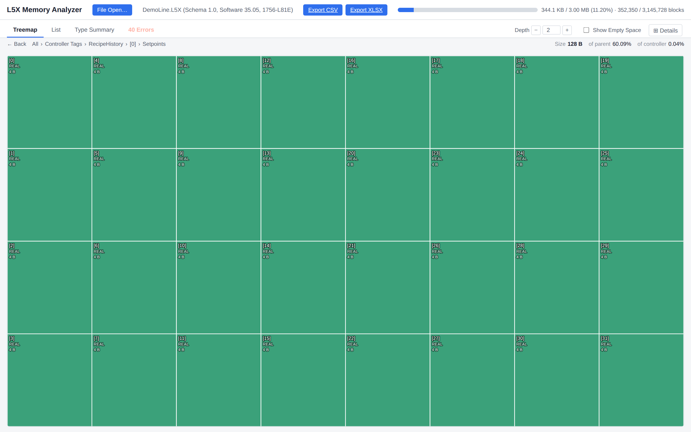
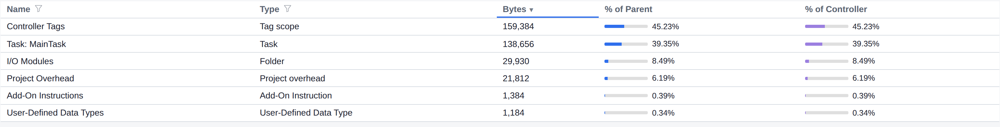
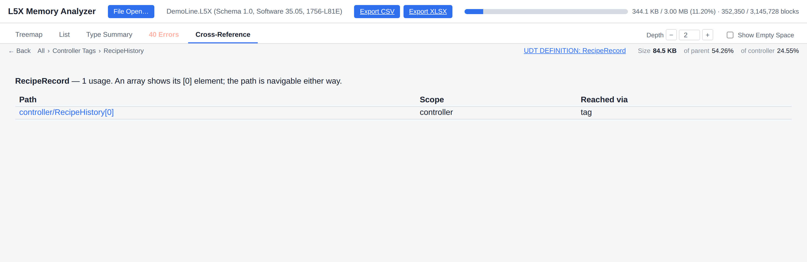

# L5X Memory Analyzer

### WinDirStat for Logix controller memory.

**Point it at an L5X export. See exactly where every byte of your controller's memory
budget is going — before a download fails with "memory full".**


Tags, UDTs, Add-On Instructions, I/O modules, alarm conditions and compiled ladder logic, all
laid out as one drillable treemap where **area is memory**. The 400-element recipe array
hiding in the top-left corner above is using a quarter of everything this controller is
doing. That is the kind of thing this tool exists to find.

---

## Why you want this

Logix Designer tells you how much memory is used. It does not tell you **what** is using
it. When a project creeps toward its limit, the usual hunt is a scroll through thousands
of tags, a guess about which UDT got bloated, and a hope that the next download fits.

The L5X Memory Analyzer replaces the hunt with a picture:

- 🔍 **Find the hog in seconds.** The biggest thing on screen is the biggest thing in
  memory. A forgotten 1,000-element array, a UDT someone padded with STRINGs, a routine
  that grew for ten years — they stand out immediately.
- 🧭 **Drill from the whole controller down to a single REAL.** Controller → task →
  program → routine → rung, or tag → array element → member → the byte.
- 📏 **Plan before you buy.** See how full a 1756-L81E would be before you order one, or
  how much headroom a migration leaves.
- 🧾 **Export the evidence.** Every number goes to CSV or XLSX for the design review.
- 🔌 **Works offline.** A single Python process and a browser tab. No cloud, no licence
  server, no Studio 5000 install required. Built for air-gapped OT workstations.

---

## The tour

### 1. The budget bar — your controller's fuel gauge


The moment a file opens, the header shows the controller catalog, the firmware, and a
budget bar for **that catalog's real capacity**. Here: 344.1 KB of a 1756-L81E's 3.00 MB,
11.2%, counted in the same blocks Studio 5000's Capacity tab uses.

### 2. Hover anything

![Tooltip zoomed: RecipeHistory, RecipeRecord[400], 84.5 KB, 24.5% of the controller](docs/images/zoom_tooltip.png)

Every tile answers the three questions that matter: **what is it, how big is it, and what
share of the controller is it?** The recipe history above is 86,488 blocks, 24.55% of the
whole controller, from a single tag declaration.

### 3. Drill in. Then keep drilling.

Click any tile to open it. The breadcrumb always shows where you are, and **Back** takes you
where you came from.

![Breadcrumb zoomed: All › Controller Tags › RecipeHistory › [0]](docs/images/zoom_breadcrumb.png)

**Into one record of the array.** Here is `RecipeHistory[0]`, member by member: a
`REAL[32]` of setpoints, a `DINT[16]` of piece counts, the scalar fields, and even the
**hidden SINT that Logix packs the UDT's BOOLs into**, laid out the way the controller
lays them out.


**Into one member.** Keep going and every element of `Setpoints` is its own 4-byte tile.



### 4. Ladder logic, priced rung by rung

Open a program, then a routine, and every rung becomes a tile labelled with its
instructions and its estimated compiled size.


Zoom in and you can read it: `ADD ONS XIC` at 80 bytes, `MOV XIC` at 40, `EQU OTL` at 36.
The fat rungs are the ones worth rewriting.


> **Honest by design.** Compiled logic size is an *estimate*: Rockwell does not publish how
> rungs compile. Every logic tile carries a **dashed outline** that means "estimated", on
> every screen, in every mode. Tag, UDT and AOI data space is *calculated*, and carries no
> such mark.

### 5. See the whole tree at once

Turn **Depth** up and the treemap nests as many levels as you ask for. Programs open into
routines, racks open into their POINT I/O cards, and arrays open into their elements, all
in one view.


### 6. How much room is left?

Tick **Show Empty Space** and the controller's free memory becomes a tile of its own. It is
the fastest way to explain headroom to someone who does not read hex.


### 7. Picture and numbers, side by side

**⊞ Details** docks a sortable table next to the treemap. It follows every drill-down.


The **List** view ranks every item at the current level by bytes, with its share of its
parent and of the whole controller. Filter by name or type.



**Type Summary** rolls the same level up by kind, which answers "is it tags or is it logic?"
in one glance.


### 8. Where is this type used?

Select a UDT or AOI and **Cross-Reference** lists every place it is instantiated: controller
tags, program tags, nested members. Every path is a link straight to it in the treemap.



### 9. A tool that tells you what it doesn't know

Most estimators give you one confident number. This one tells you **how much of that number
to trust**.


The **File confidence** card splits the prediction by evidence: **Exact** (calculated from
known sizes), **Measured** (fitted and checked against real controller readings), and
**Unverified**. Anything the model cannot price is listed by name and never silently
counted as zero: here, POINT I/O cards on a rack-optimized connection.


Source-protected routines and AOIs get the same treatment. The tool prices what it can see
(the interface, the instances, the calls) and raises a red **MINIMUM** banner, because
nobody can see inside the encryption.

Add `?ConfidenceMode=true` to the address and the whole treemap is recoloured by confidence
band, so the estimated parts of a project are visible at a glance.


---

## How accurate is it?

Measured against **seventeen real production programs** (1756-L8x and CompactLogix 5380,
standard processors), each compared with the memory figure Studio 5000 reports for the
real compiled project:

| | |
|---|---|
| **Mean absolute error** | **1.66%** |
| **Worst case** | **4.83%** (a program carrying 39 source-protected routines the tool cannot see inside) |
| **Blind test** | a 7.89 MB program predicted at **+2.15%** before its real figure was used for anything |

**Read the worst case as "up to about 5%" on a file the tool has never seen.** The blind
test is the number that matters most: it is the only one no tuning could have touched.

Why the tool can be this close:

- **Tag, UDT and AOI data space is calculated exactly.** Atomic sizes, alignment, BOOL
  packing into hidden SINTs, string lengths and nested arrays are known rules, verified
  against real controller readings.
- **Compiled logic is fitted, instruction by instruction.** Each instruction's weight,
  including its operand types, its indirect addressing, JSR parameters and CPT expression
  structure, is measured on purpose-built test projects compiled in Studio 5000 and read
  back from the Capacity tab. **Over 3,000 captured test projects** sit behind the model.
- **It is checked against real programs, not just its own test files.** The generated
  corpus is the measuring instrument. The real programs are the scoreboard.

The full method, every constant, and every open question are published in
[`docs/`](docs/).

---

## Get started in one minute

```bash
git clone https://github.com/jholm90/logixMemoryMap.git
cd logixMemoryMap
pip install -e .
l5x-memory-analyzer ui path/to/YourProject.L5X
```

Your browser opens at `http://127.0.0.1:8765` with the project loaded. Export the L5X from
Logix Designer with **File › Save As › L5X**.

Leave the path off to start with a file picker, which is handy for a desktop shortcut with no
command prompt:

```bash
l5x-memory-analyzer ui
```

Options: `--host` (default `127.0.0.1`), `--port` (default `8765`), `--no-browser`.

### Prefer the command line?

```bash
l5x-memory-analyzer size   YourProject.L5X            # flat byte breakdown
l5x-memory-analyzer export YourProject.L5X out.xlsx   # CSV or XLSX report
l5x-memory-analyzer dump   YourProject.L5X            # raw parsed XML
```

Without installing, run the same subcommands from `src/` as
`python -m l5x_memory_analyzer.cli <subcommand> ...`.

---

## What it understands

| content | how it is sized |
|---|---|
| Controller and program tags, all atomic types | exact |
| UDTs, nested UDTs, arrays of UDTs, BOOL packing | exact |
| STRING and custom string types | exact |
| Add-On Instruction definitions, instances, parameters, internal logic | calculated + fitted |
| Ladder logic: 100+ instructions, operand types, indirect addressing, branches | fitted, flagged estimated |
| JSR / SBR / RET with and without parameters | fitted, flagged estimated |
| CPT / CMP expressions, by operator structure | fitted, flagged estimated |
| Structured Text | fitted, flagged estimated |
| Tasks, programs, routines | measured |
| I/O modules: 1756, 5069, POINT I/O, Kinetix 5700 drives and supplies, generic Ethernet | measured per family, with a fallback for unseen catalogs |
| Axes and motion groups | measured |
| Tag-based alarm conditions | measured |
| Source-protected routines and AOIs | priced at a flagged **minimum** |

## Platform support

| platform | status |
|---|---|
| **1756-L8x ControlLogix** | ✅ supported, well represented in the real validation set |
| **5069 / CompactLogix 5380** | ✅ supported, represented in the real validation set |
| GuardLogix safety controllers | sized, but safety memory is a separate partition, so accuracy is quoted for standard processors only |
| 1756-L7x, 1769 | older architecture: existing support kept, no new development |
| 1756-L9x | firmware matrix only, no real validation yet |

---

## The screenshots

Every picture above comes from a **synthetic demo project**, not a customer file. It has five
POINT I/O racks, four production-line programs of machine stations, a valve AOI with sixty
instances, and one deliberately oversized recipe array. Rebuild it and explore it yourself:

```bash
python scripts/build_demo_project.py
l5x-memory-analyzer ui docs/demo/DemoLine.L5X
```

---

## Documentation

| file | contents |
|---|---|
| [FINAL_REPORT.md](docs/FINAL_REPORT.md) | **start here**: results, wins, losses, what is open, how to get more accuracy |
| [MEMORY_MODEL.md](docs/MEMORY_MODEL.md) | every sizing constant, formula and packing rule |
| [OPEN_QUESTIONS.md](docs/OPEN_QUESTIONS.md) | unresolved sizing and behaviour questions |
| [RESOLVED_QUESTIONS.md](docs/RESOLVED_QUESTIONS.md) | closed questions and why |
| [TASKS.md](docs/TASKS.md) | the ranked work queue |
| [PROJECT_PLAN.md](docs/PROJECT_PLAN.md) | phases and their exit criteria |
| [ROADMAP.md](docs/ROADMAP.md) | where the tool stands and what is next |
| [INSTRUCTION_COVERAGE.md](docs/INSTRUCTION_COVERAGE.md) | per-instruction weight status against real usage |
| [AOI_KNOWLEDGE_MAP.md](docs/AOI_KNOWLEDGE_MAP.md) | what is known and unknown about AOI sizing |
| [TESTING_PLAN.md](docs/TESTING_PLAN.md) | how predictions are validated against real controllers |
| [SAMPLE_GENERATION.md](docs/SAMPLE_GENERATION.md) | how test files are built, and every batch |
| [COMMANDS.md](docs/COMMANDS.md) | every script and CLI command |
| [IO_MODULES.md](docs/IO_MODULES.md) | module and I/O sizing reference |
| [CMP_CPT_REFERENCE.md](docs/CMP_CPT_REFERENCE.md) | expression instruction reference |
| [OPEN_BUILD_ERRORS.md](docs/OPEN_BUILD_ERRORS.md) | sample files that will not build |
| `CLAUDE.md` | working context and the rules that govern changes |

## Licence

Apache-2.0. Python end to end.

`tools/ra-logix-designer-vcs-custom-tools/` is Rockwell Automation's `l5xgit` source,
vendored under its own MIT licence for the capture pipeline's L5X→ACD conversion; see
[tools/README.md](tools/README.md).

*Logix, Studio 5000, ControlLogix, CompactLogix, GuardLogix, POINT I/O and Kinetix are
trademarks of Rockwell Automation, Inc. This project is independent and is not affiliated
with or endorsed by Rockwell Automation.*
